<!-- markdownlint-disable -->
<h1 align="center">
    自然语言处理项目&工具库&资源大全
     
</h1>

    <strong>自然语言处理项目&工具库&资源大全，划分子领域版块汇集梳理，每周自动更新</strong>

    
    
    

本资源清单包含100个python自然语言处理相关的项目&工具库&资源，这些资源总共分成11个不同的子板块，这些项目目前在github上已经收到180K个点赞。所有的工具资源每周会自动从GitHub和工具维护平台采集信息，并更新梳理展示。本清单参考[best-of模板](https://github.com/best-of-lists/best-of)完成，欢迎大家提PR丰富本清单。

---

## 目录

- [文本分类](#文本分类) _9 个项目案例_
- [情感分析](#情感分析) _6 个项目案例_
- [序列标注](#序列标注) _5 个项目案例_
- [问答系统与聊天机器人](#问答系统与聊天机器人) _8 个项目案例_
- [语音应用](#语音应用) _11 个项目案例_
- [知识图谱](#知识图谱) _10 个项目案例_
- [文本生成](#文本生成) _11 个项目案例_
- [文本摘要生成](#文本摘要生成) _10 个项目案例_
- [阅读理解](#阅读理解) _4 个项目案例_
- [时间序列](#时间序列) _10 个项目案例_
- [机器翻译](#机器翻译) _8 个项目案例_
- [文本检索与语义匹配](#文本检索与语义匹配) _9 个项目案例_

 

## 文本分类

<table width="100%"><tr align="center"><td valign="top" width="33.3%"> <a href="https://github.com/facebookresearch/fastText">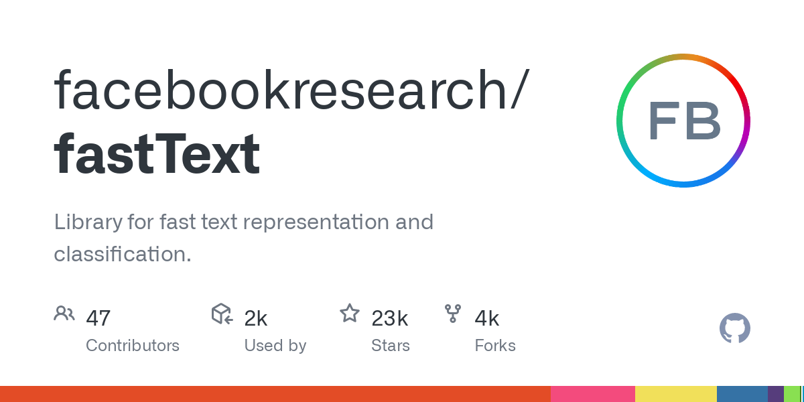</a> <h3><a href="https://github.com/facebookresearch/fastText">facebookresearch-fastText</a></h3>
⭐ 24K · <a href="https://github.com/facebookresearch/fastText">:octocat: Code</a>

facebookresearch的fastText工具库

by <a href="https://github.com/facebookresearch">@facebookresearch</a>
</td><td valign="top" width="33.3%">  <h3><a href="https://github.com/brightmart/text_classification">text_classification(brightmart)</a></h3>
⭐ 7.4K · <a href="https://github.com/brightmart/text_classification">:octocat: Code</a>

brightmart实现的多种中文文本分类模型

by <a href="https://github.com/brightmart">@brightmart</a>
</td><td valign="top" width="33.3%"> <a href="https://github.com/facebookresearch/pytext">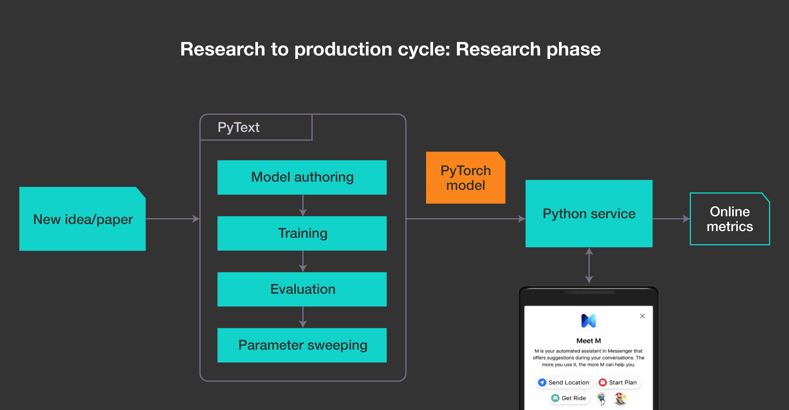</a> <h3><a href="https://github.com/facebookresearch/pytext">facebookresearch-pytext</a></h3>
⭐ 6.3K · <a href="https://github.com/facebookresearch/pytext">:octocat: Code</a>

facebookresearch的pytext工具库

by <a href="https://github.com/facebookresearch">@facebookresearch</a>
</td></tr><tr align="center"><td valign="top" width="33.3%"> <a href="https://github.com/PaddlePaddle/PaddleNLP">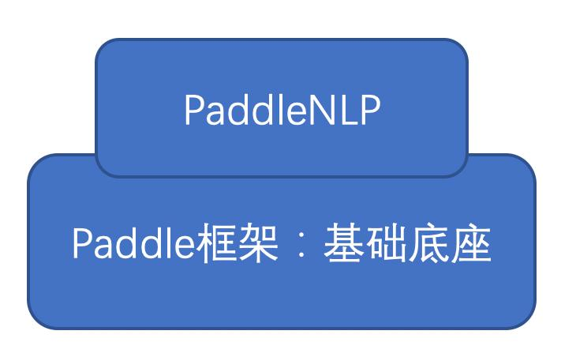</a> <h3><a href="https://github.com/PaddlePaddle/PaddleNLP">PaddleNLP</a></h3>
⭐ 5.2K · <a href="https://github.com/PaddlePaddle/PaddleNLP">:octocat: Code</a>

PaddlePaddle NLP工具库

by <a href="https://github.com/PaddlePaddle">@PaddlePaddle</a>
</td><td valign="top" width="33.3%"> <a href="https://github.com/PaddlePaddle/ERNIE">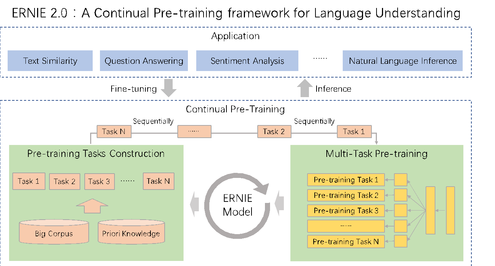</a> <h3><a href="https://github.com/PaddlePaddle/ERNIE">Paddle-ERNIE</a></h3>
⭐ 5.1K · <a href="https://github.com/PaddlePaddle/ERNIE">:octocat: Code</a>

PaddlePaddle实现的ERNIE

by <a href="https://github.com/PaddlePaddle">@PaddlePaddle</a>
</td><td valign="top" width="33.3%"> <a href="https://github.com/649453932/Chinese-Text-Classification-Pytorch">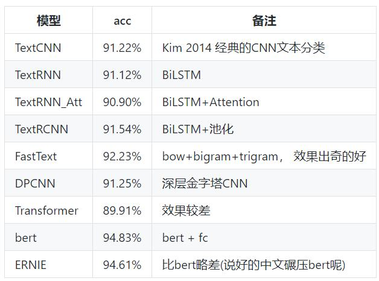</a> <h3><a href="https://github.com/649453932/Chinese-Text-Classification-Pytorch">Chinese-Text-Classification-Pytorch</a></h3>
⭐ 3.8K · <a href="https://github.com/649453932/Chinese-Text-Classification-Pytorch">:octocat: Code</a>

Pytorch实现的多种中文文本分类模型

by <a href="https://github.com/649453932">@649453932</a>
</td></tr><tr align="center"><td valign="top" width="33.3%">  <h3><a href="https://github.com/649453932/Bert-Chinese-Text-Classification-Pytorch">Bert-Chinese-Text-Classification-Pytorch</a></h3>
⭐ 2.5K · <a href="https://github.com/649453932/Bert-Chinese-Text-Classification-Pytorch">:octocat: Code</a>

Pytorch实现的基于transformer/BERT的中文文本分类模型

by <a href="https://github.com/649453932">@649453932</a>
</td><td valign="top" width="33.3%">  <h3><a href="https://github.com/kk7nc/Text_Classification">Text_Classification</a></h3>
⭐ 1.6K · <a href="https://github.com/kk7nc/Text_Classification">:octocat: Code</a>

kk7nc Text_Classification

by <a href="https://github.com/kk7nc">@kk7nc</a>
</td><td valign="top" width="33.3%">  <h3><a href="https://github.com/Tencent/NeuralNLP-NeuralClassifier">NeuralNLP-NeuralClassifier(Tencent)</a></h3>
⭐ 1.4K · <a href="https://github.com/Tencent/NeuralNLP-NeuralClassifier">:octocat: Code</a>

腾讯文本分类开源项目，包含多种模型实现和完整模型构建流程

by <a href="https://github.com/Tencent">@Tencent</a>
</td></tr></table>

 

## 情感分析

<table width="100%"><tr align="center"><td valign="top" width="33.3%"> <a href="https://github.com/bentrevett/pytorch-sentiment-analysis">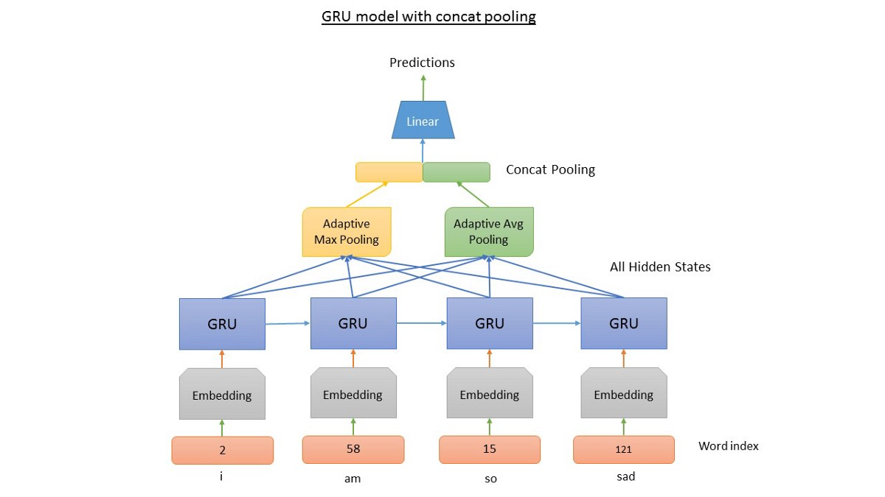</a> <h3><a href="https://github.com/bentrevett/pytorch-sentiment-analysis">pytorch-sentiment-analysis</a></h3>
⭐ 3.6K · <a href="https://github.com/bentrevett/pytorch-sentiment-analysis">:octocat: Code</a>

pytorch实现的情感分析建模

by <a href="https://github.com/bentrevett">@bentrevett</a>
</td><td valign="top" width="33.3%">  <h3><a href="https://github.com/songyouwei/ABSA-PyTorch">Aspect-Based-Sentiment-Analysis</a></h3>
⭐ 1.6K · <a href="https://github.com/songyouwei/ABSA-PyTorch">:octocat: Code</a>

基于不同粒度的图卷积网络情感分析实现。

by <a href="https://github.com/songyouwei">@songyouwei</a>
</td><td valign="top" width="33.3%"> <a href="https://github.com/baidu/Senta">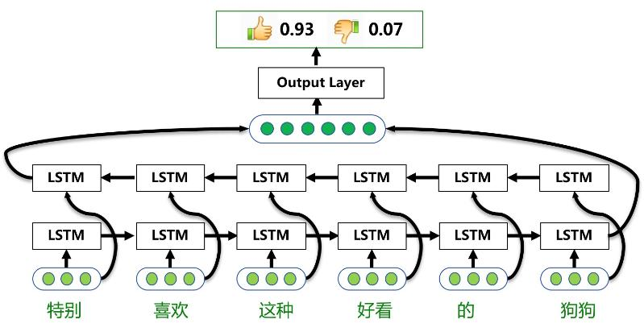</a> <h3><a href="https://github.com/baidu/Senta">baidu-Senta</a></h3>
⭐ 1.6K · <a href="https://github.com/baidu/Senta">:octocat: Code</a>

百度的Senta情感分析项目

by <a href="https://github.com/baidu">@baidu</a>
</td></tr><tr align="center"><td valign="top" width="33.3%"> <a href="https://github.com/cxy229/BDCI2019-SENTIMENT-CLASSIFICATION">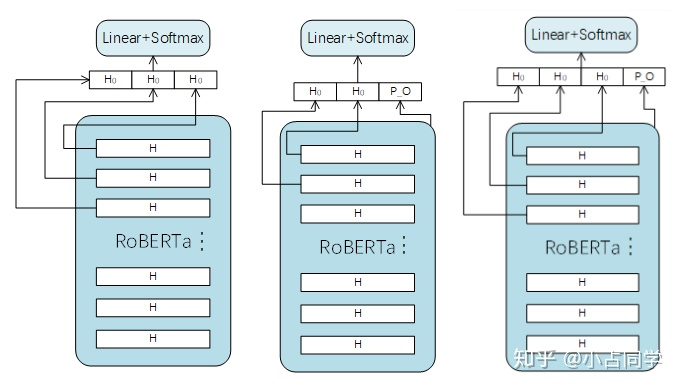</a> <h3><a href="https://github.com/cxy229/BDCI2019-SENTIMENT-CLASSIFICATION">BDCI2019-Sentiment-classification</a></h3>
⭐ 440 · <a href="https://github.com/cxy229/BDCI2019-SENTIMENT-CLASSIFICATION">:octocat: Code</a>

BDCI2019情感分析比赛第1名方案

by <a href="https://github.com/cxy229">@cxy229</a>
</td><td valign="top" width="33.3%"> <a href="https://github.com/CarryChang/Customer_Satisfaction_Analysis">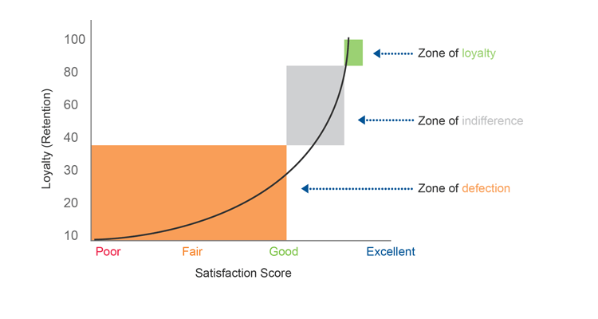</a> <h3><a href="https://github.com/CarryChang/Customer_Satisfaction_Analysis">Customer_Satisfaction_Analysis</a></h3>
⭐ 330 · <a href="https://github.com/CarryChang/Customer_Satisfaction_Analysis">:octocat: Code</a>

消费者满意度分析建模

by <a href="https://github.com/CarryChang">@CarryChang</a>
</td><td valign="top" width="33.3%">  <h3><a href="https://github.com/lsvih/chinese-customer-review">chinese-customer-review</a></h3>
⭐ 34 · <a href="https://github.com/lsvih/chinese-customer-review">:octocat: Code</a>

中文点评网站评论数据

by <a href="https://github.com/lsvih">@lsvih</a>
</td></tr></table>

 

## 序列标注

<table width="100%"><tr align="center"><td valign="top" width="33.3%"> <a href="https://github.com/z814081807/DeepNER">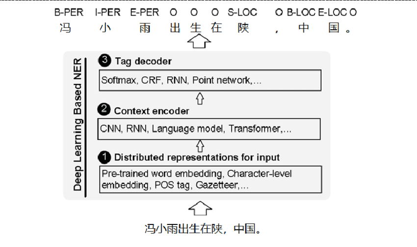</a> <h3><a href="https://github.com/z814081807/DeepNER">Chinese-DeepNER</a></h3>
⭐ 700 · <a href="https://github.com/z814081807/DeepNER">:octocat: Code</a>

深度学习命名实体识别项目

by <a href="https://github.com/z814081807">@z814081807</a>
</td><td valign="top" width="33.3%"> <a href="https://github.com/yuanxiaosc/BERT-for-Sequence-Labeling-and-Text-Classification">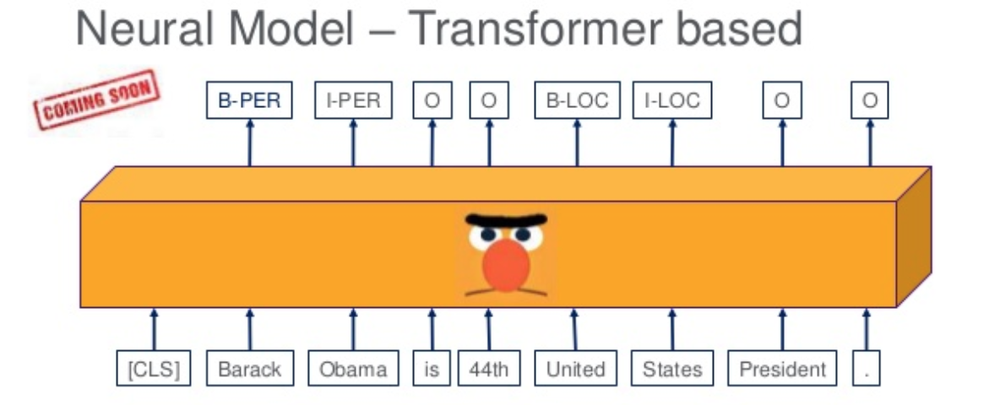</a> <h3><a href="https://github.com/yuanxiaosc/BERT-for-Sequence-Labeling-and-Text-Classification">BERT-for-Sequence-Labeling-and-Text-Classification</a></h3>
⭐ 410 · <a href="https://github.com/yuanxiaosc/BERT-for-Sequence-Labeling-and-Text-Classification">:octocat: Code</a>

基于bert的序列标注与文本分类

by <a href="https://github.com/yuanxiaosc">@yuanxiaosc</a>
</td><td valign="top" width="33.3%"> <a href="https://github.com/qiufengyuyi/sequence_tagging">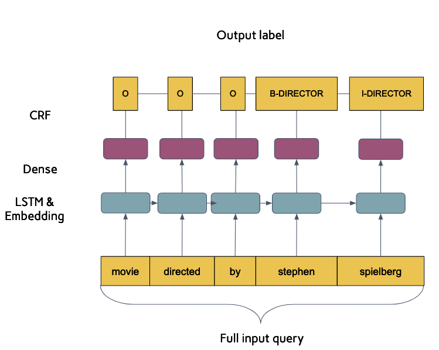</a> <h3><a href="https://github.com/qiufengyuyi/sequence_tagging">sequence_tagging</a></h3>
⭐ 390 · <a href="https://github.com/qiufengyuyi/sequence_tagging">:octocat: Code</a>

序列标注实现

by <a href="https://github.com/qiufengyuyi">@qiufengyuyi</a>
</td></tr><tr align="center"><td valign="top" width="33.3%">  <h3><a href="https://github.com/yongzhuo/Macadam">Macadam</a></h3>
⭐ 300 · <a href="https://github.com/yongzhuo/Macadam">:octocat: Code</a>

Macadam是一个以Tensorflow(Keras)和bert4keras为基础，专注于文本分类、序列标注和关系抽取的自然语言处理工具包。

by <a href="https://github.com/yongzhuo">@yongzhuo</a>
</td><td valign="top" width="33.3%">  <h3><a href="https://github.com/howl-anderson/seq2annotation">seq2annotation</a></h3>
⭐ 80 · <a href="https://github.com/howl-anderson/seq2annotation">:octocat: Code</a>

序列标注的实现方案

by <a href="https://github.com/howl-anderson">@howl-anderson</a>
</td></tr></table>

 

## 问答系统与聊天机器人

<table width="100%"><tr align="center"><td valign="top" width="33.3%">  <h3><a href="https://github.com/deepmipt/DeepPavlov">DeepPavlov</a></h3>
⭐ 5.8K · <a href="https://github.com/deepmipt/DeepPavlov">:octocat: Code</a>

深度学习端到端的对话系统

by <a href="https://github.com/deepmipt">@deepmipt</a>
</td><td valign="top" width="33.3%">  <h3><a href="https://github.com/deepset-ai/haystack">haystack</a></h3>
⭐ 5.2K · <a href="https://github.com/deepset-ai/haystack">:octocat: Code</a>

端到端的深度学习问答检索系统

by <a href="https://github.com/deepset-ai">@deepset-ai</a>
</td><td valign="top" width="33.3%"> <a href="https://github.com/baidu/AnyQ">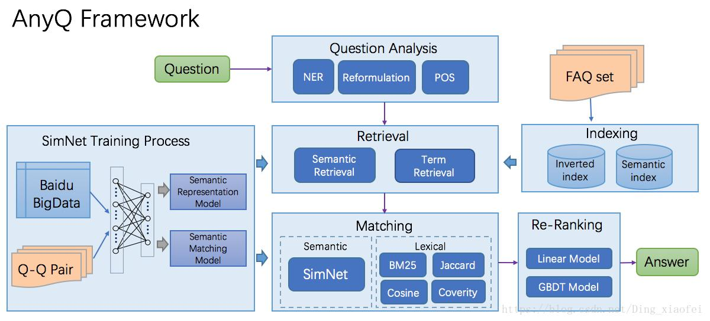</a> <h3><a href="https://github.com/baidu/AnyQ">baidu-AnyQ</a></h3>
⭐ 2.4K · <a href="https://github.com/baidu/AnyQ">:octocat: Code</a>

百度的AnyQ高频问题检索式问答系统

by <a href="https://github.com/baidu">@baidu</a>
</td></tr><tr align="center"><td valign="top" width="33.3%">  <h3><a href="https://github.com/charlesXu86/Chatbot_CN">Chatbot_CN</a></h3>
⭐ 1.1K · <a href="https://github.com/charlesXu86/Chatbot_CN">:octocat: Code</a>

基于金融-司法领域(兼有闲聊性质)的聊天机器人

by <a href="https://github.com/charlesXu86">@charlesXu86</a>
</td><td valign="top" width="33.3%">  <h3><a href="https://github.com/Doragd/Chinese-Chatbot-PyTorch-Implementation">Chinese-Chatbot-PyTorch</a></h3>
⭐ 670 · <a href="https://github.com/Doragd/Chinese-Chatbot-PyTorch-Implementation">:octocat: Code</a>

基于pytorch实现的对话机器人

by <a href="https://github.com/Doragd">@Doragd</a>
</td><td valign="top" width="33.3%"> <a href="https://github.com/wuba/qa_match">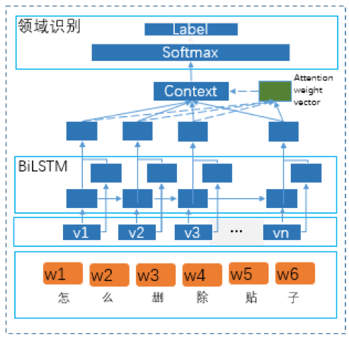</a> <h3><a href="https://github.com/wuba/qa_match">58-qa_match</a></h3>
⭐ 310 · <a href="https://github.com/wuba/qa_match">:octocat: Code</a>

58的匹配型问答系统实现

by <a href="https://github.com/wuba">@wuba</a>
</td></tr><tr align="center"><td valign="top" width="33.3%"> <a href="https://github.com/kushalj001/pytorch-question-answering">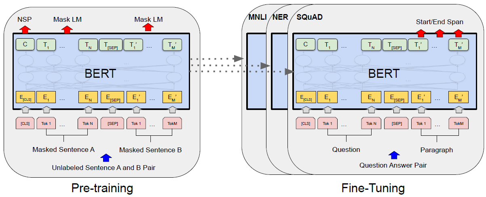</a> <h3><a href="https://github.com/kushalj001/pytorch-question-answering">pytorch-question-answering</a></h3>
⭐ 240 · <a href="https://github.com/kushalj001/pytorch-question-answering">:octocat: Code</a>

pytorch问答系统实现

by <a href="https://github.com/kushalj001">@kushalj001</a>
</td><td valign="top" width="33.3%"> <a href="https://github.com/lots-of-things/gpt2-bert-reddit-bot">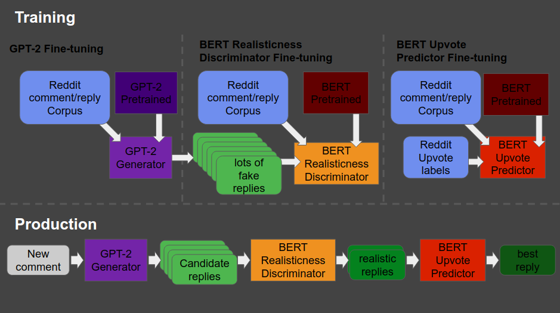</a> <h3><a href="https://github.com/lots-of-things/gpt2-bert-reddit-bot">gpt2-bert-reddit-bot</a></h3>
⭐ 180 · <a href="https://github.com/lots-of-things/gpt2-bert-reddit-bot">:octocat: Code</a>

基于gpt2和bert的reddit问答机器人实现

by <a href="https://github.com/lots-of-things">@lots-of-things</a>
</td></tr></table>

 

## 语音应用

<table width="100%"><tr align="center"><td valign="top" width="33.3%">  <h3><a href="https://github.com/nl8590687/ASRT_SpeechRecognition">ASRT_SpeechRecognition</a></h3>
⭐ 5.7K · <a href="https://github.com/nl8590687/ASRT_SpeechRecognition">:octocat: Code</a>

基于深度学习的中文语音识别系统

by <a href="https://github.com/nl8590687">@nl8590687</a>
</td><td valign="top" width="33.3%"> <a href="https://github.com/TensorSpeech/TensorFlowTTS">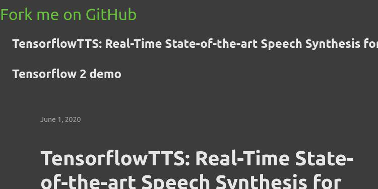</a> <h3><a href="https://github.com/TensorSpeech/TensorFlowTTS">TensorFlowTTS</a></h3>
⭐ 2.8K · <a href="https://github.com/TensorSpeech/TensorFlowTTS">:octocat: Code</a>

tensorflow实现的文本转语音项目

by <a href="https://github.com/TensorSpeech">@TensorSpeech</a>
</td><td valign="top" width="33.3%"> <a href="https://github.com/NVIDIA/waveglow">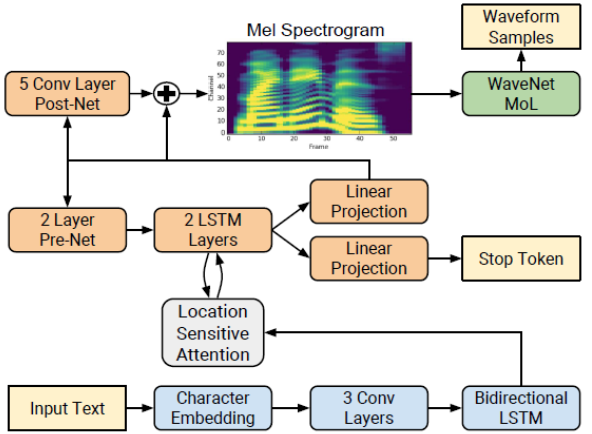</a> <h3><a href="https://github.com/NVIDIA/waveglow">NVIDIA-waveglow</a></h3>
⭐ 2K · <a href="https://github.com/NVIDIA/waveglow">:octocat: Code</a>

NVIDIA的waveglow语音合成项目

by <a href="https://github.com/NVIDIA">@NVIDIA</a>
</td></tr><tr align="center"><td valign="top" width="33.3%">  <h3><a href="https://github.com/as-ideas/TransformerTTS">TransformerTTS</a></h3>
⭐ 920 · <a href="https://github.com/as-ideas/TransformerTTS">:octocat: Code</a>

基于transformer的tts文本转语音实现

by <a href="https://github.com/as-ideas">@as-ideas</a>
</td><td valign="top" width="33.3%">  <h3><a href="https://github.com/timsainb/noisereduce">noisereduce</a></h3>
⭐ 720 · <a href="https://github.com/timsainb/noisereduce">:octocat: Code</a>

智能降噪项目

by <a href="https://github.com/timsainb">@timsainb</a>
</td><td valign="top" width="33.3%"> <a href="https://github.com/kaituoxu/Speech-Transformer">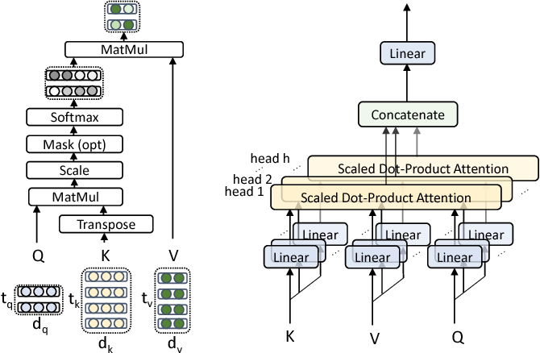</a> <h3><a href="https://github.com/kaituoxu/Speech-Transformer">Speech-Transformer</a></h3>
⭐ 690 · <a href="https://github.com/kaituoxu/Speech-Transformer">:octocat: Code</a>

Speech-Transformer语音识别项目

by <a href="https://github.com/kaituoxu">@kaituoxu</a>
</td></tr><tr align="center"><td valign="top" width="33.3%">  <h3><a href="https://github.com/Tomiinek/Multilingual_Text_to_Speech">Multilingual_Text_to_Speech</a></h3>
⭐ 580 · <a href="https://github.com/Tomiinek/Multilingual_Text_to_Speech">:octocat: Code</a>

多语言文本转语音实现

by <a href="https://github.com/Tomiinek">@Tomiinek</a>
</td><td valign="top" width="33.3%">  <h3><a href="https://github.com/ina-foss/inaSpeechSegmenter">inaSpeechSegmenter</a></h3>
⭐ 520 · <a href="https://github.com/ina-foss/inaSpeechSegmenter">:octocat: Code</a>

语音智能分割项目

by <a href="https://github.com/ina-foss">@ina-foss</a>
</td><td valign="top" width="33.3%"> <a href="https://github.com/vbelz/Speech-enhancement">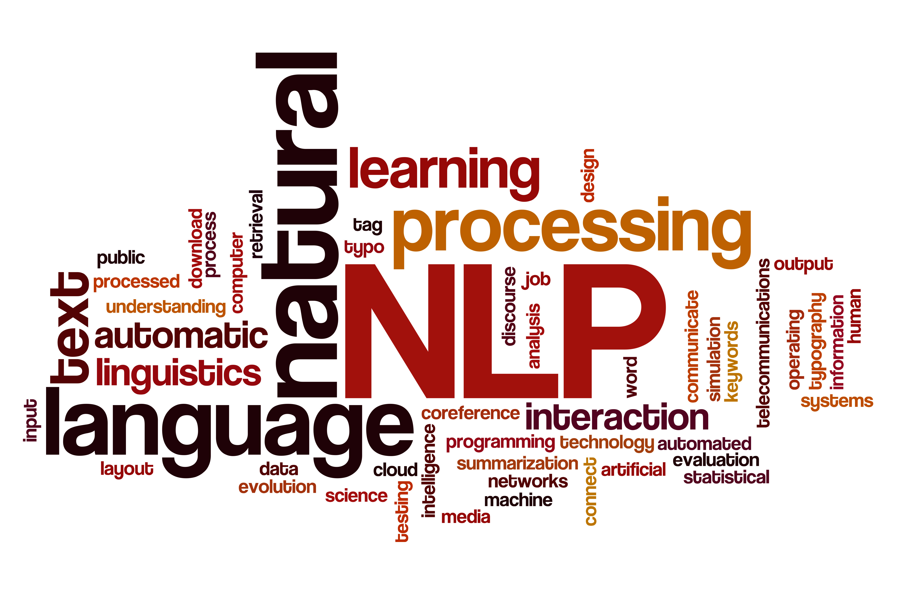</a> <h3><a href="https://github.com/vbelz/Speech-enhancement">Speech-enhancement</a></h3>
⭐ 390 · <a href="https://github.com/vbelz/Speech-enhancement">:octocat: Code</a>

语音增强项目

by <a href="https://github.com/vbelz">@vbelz</a>
</td></tr><tr align="center"><td valign="top" width="33.3%"> <a href="https://github.com/ZhengkunTian/OpenTransformer">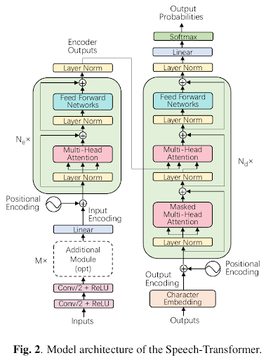</a> <h3><a href="https://github.com/ZhengkunTian/OpenTransformer">OpenTransformer</a></h3>
⭐ 310 · <a href="https://github.com/ZhengkunTian/OpenTransformer">:octocat: Code</a>

基于transformer的语音识别

by <a href="https://github.com/ZhengkunTian">@ZhengkunTian</a>
</td><td valign="top" width="33.3%"> <a href="https://github.com/ide8/tacotron2">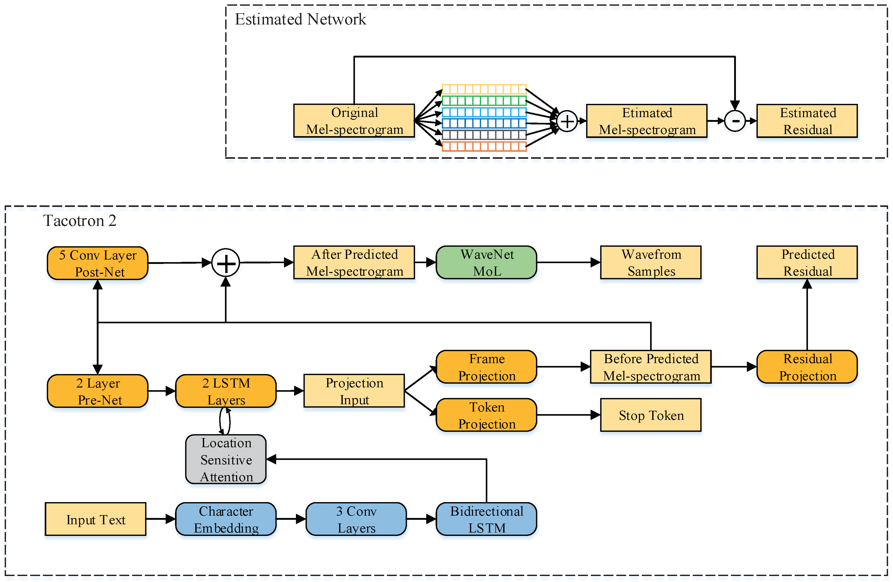</a> <h3><a href="https://github.com/ide8/tacotron2">tacotron2</a></h3>
⭐ 100 · <a href="https://github.com/ide8/tacotron2">:octocat: Code</a>

tacotron2语音合成项目

by <a href="https://github.com/ide8">@ide8</a>
</td></tr></table>

 

## 知识图谱

<table width="100%"><tr align="center"><td valign="top" width="33.3%"> <a href="https://github.com/liuhuanyong/QASystemOnMedicalKG">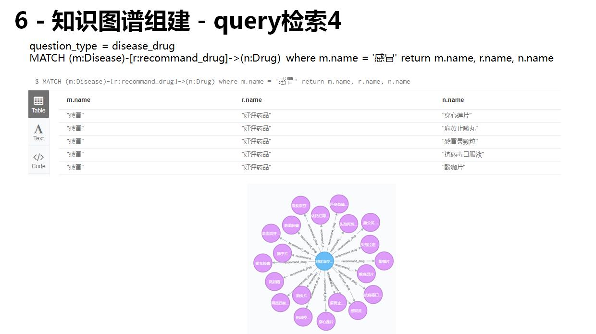</a> <h3><a href="https://github.com/liuhuanyong/QASystemOnMedicalKG">QASystemOnMedicalKG</a></h3>
⭐ 4.2K · <a href="https://github.com/liuhuanyong/QASystemOnMedicalKG">:octocat: Code</a>

医疗知识图谱构建与问答推理

by <a href="https://github.com/liuhuanyong">@liuhuanyong</a>
</td><td valign="top" width="33.3%">  <h3><a href="https://github.com/ownthink/KnowledgeGraphData">KnowledgeGraphData</a></h3>
⭐ 4.1K · <a href="https://github.com/ownthink/KnowledgeGraphData">:octocat: Code</a>

知识图谱数据集合

by <a href="https://github.com/ownthink">@ownthink</a>
</td><td valign="top" width="33.3%"> <a href="https://github.com/husthuke/awesome-knowledge-graph">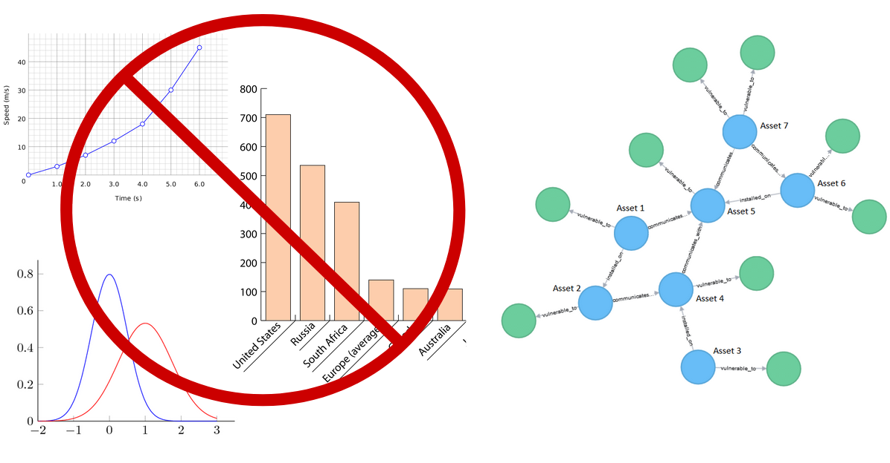</a> <h3><a href="https://github.com/husthuke/awesome-knowledge-graph">awesome-knowledge-graph</a></h3>
⭐ 3.4K · <a href="https://github.com/husthuke/awesome-knowledge-graph">:octocat: Code</a>

awesome知识图谱资料

by <a href="https://github.com/husthuke">@husthuke</a>
</td></tr><tr align="center"><td valign="top" width="33.3%"> <a href="https://github.com/qq547276542/Agriculture_KnowledgeGraph">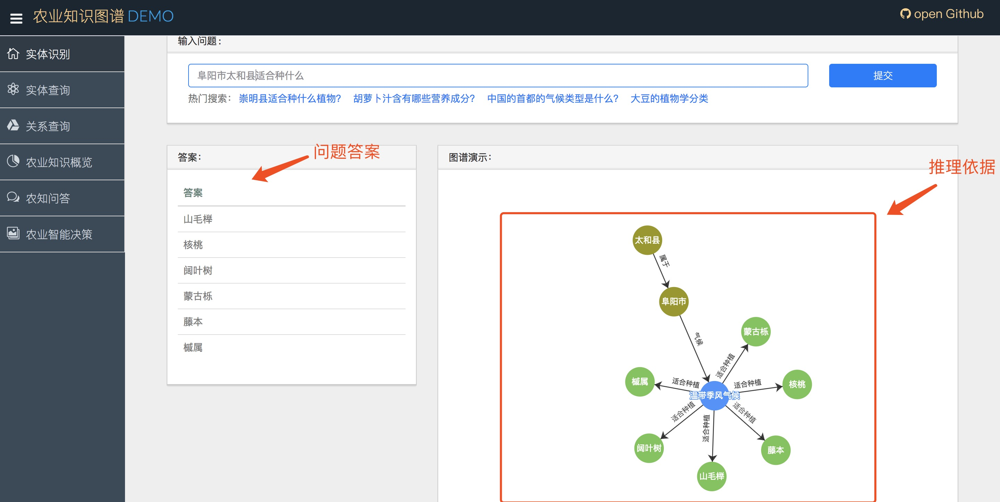</a> <h3><a href="https://github.com/qq547276542/Agriculture_KnowledgeGraph">Agriculture_KnowledgeGraph</a></h3>
⭐ 3.2K · <a href="https://github.com/qq547276542/Agriculture_KnowledgeGraph">:octocat: Code</a>

农业知识图谱项目

by <a href="https://github.com/qq547276542">@qq547276542</a>
</td><td valign="top" width="33.3%"> <a href="https://github.com/npubird/KnowledgeGraphCourse">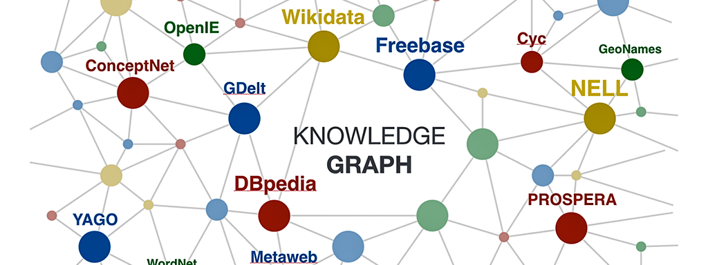</a> <h3><a href="https://github.com/npubird/KnowledgeGraphCourse">KnowledgeGraphCourse</a></h3>
⭐ 3K · <a href="https://github.com/npubird/KnowledgeGraphCourse">:octocat: Code</a>

东南大学知识图谱课程

by <a href="https://github.com/npubird">@npubird</a>
</td><td valign="top" width="33.3%"> <a href="https://github.com/jm199504/Financial-Knowledge-Graphs">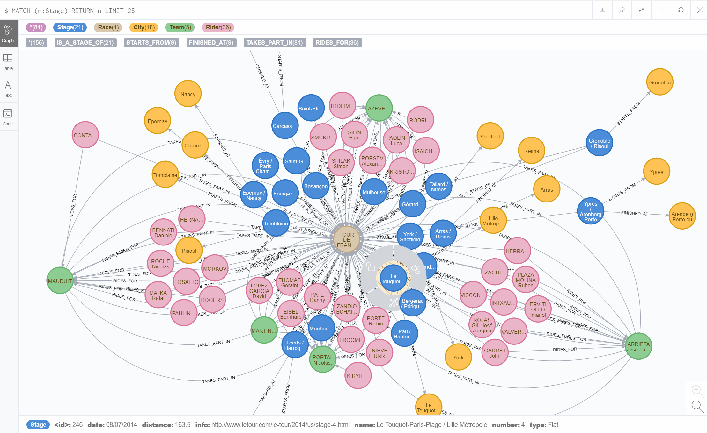</a> <h3><a href="https://github.com/jm199504/Financial-Knowledge-Graphs">Financial-Knowledge-Graphs</a></h3>
⭐ 1.9K · <a href="https://github.com/jm199504/Financial-Knowledge-Graphs">:octocat: Code</a>

金融知识图谱项目

by <a href="https://github.com/jm199504">@jm199504</a>
</td></tr><tr align="center"><td valign="top" width="33.3%">  <h3><a href="https://github.com/lemonhu/stock-knowledge-graph">stock-knowledge-graph</a></h3>
⭐ 1.6K · <a href="https://github.com/lemonhu/stock-knowledge-graph">:octocat: Code</a>

股票金融知识图谱项目

by <a href="https://github.com/lemonhu">@lemonhu</a>
</td><td valign="top" width="33.3%"> <a href="https://github.com/shaoxiongji/knowledge-graphs">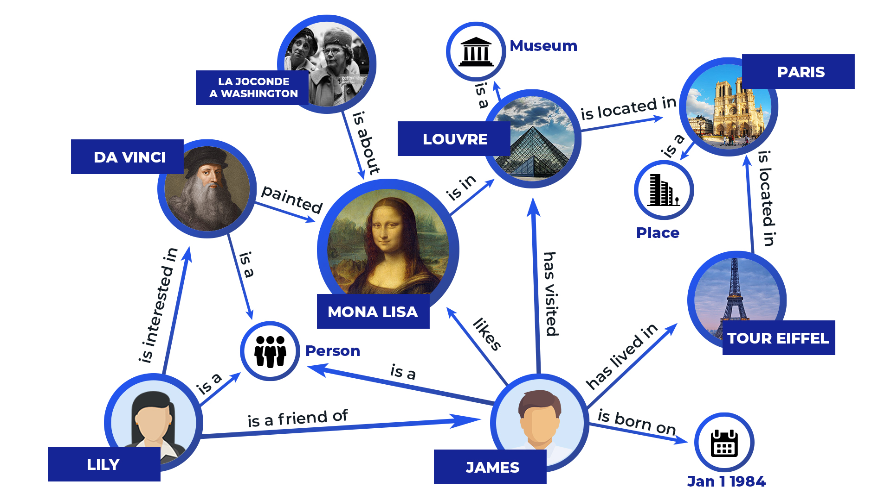</a> <h3><a href="https://github.com/shaoxiongji/knowledge-graphs">knowledge-graphs</a></h3>
⭐ 1.3K · <a href="https://github.com/shaoxiongji/knowledge-graphs">:octocat: Code</a>

知识图谱

by <a href="https://github.com/shaoxiongji">@shaoxiongji</a>
</td><td valign="top" width="33.3%"> <a href="https://github.com/lihanghang/NLP-Knowledge-Graph">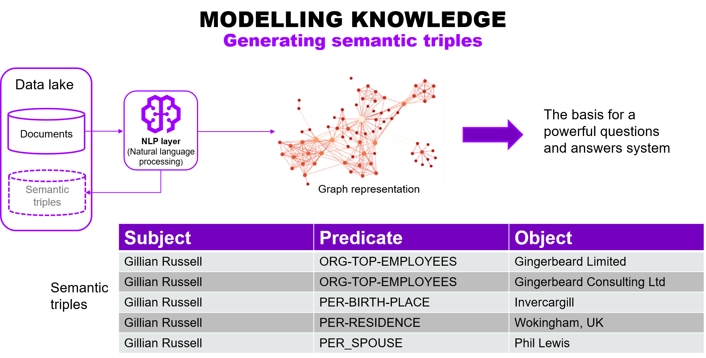</a> <h3><a href="https://github.com/lihanghang/NLP-Knowledge-Graph">NLP-Knowledge-Graph</a></h3>
⭐ 1.2K · <a href="https://github.com/lihanghang/NLP-Knowledge-Graph">:octocat: Code</a>

NLP知识图谱资料

by <a href="https://github.com/lihanghang">@lihanghang</a>
</td></tr><tr align="center"><td valign="top" width="33.3%"> <a href="https://github.com/zhihao-chen/QASystemOnMedicalGraph">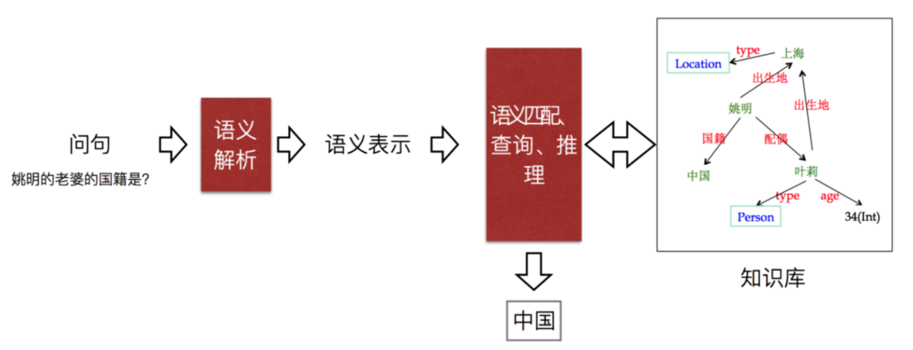</a> <h3><a href="https://github.com/zhihao-chen/QASystemOnMedicalGraph">QASystemOnMedicalGraph</a></h3>
⭐ 860 · <a href="https://github.com/zhihao-chen/QASystemOnMedicalGraph">:octocat: Code</a>

基于医疗知识图谱的问答系统

by <a href="https://github.com/zhihao-chen">@zhihao-chen</a>
</td></tr></table>

 

## 文本生成

<table width="100%"><tr align="center"><td valign="top" width="33.3%">  <h3><a href="https://github.com/Morizeyao/GPT2-Chinese">GPT2-Chinese</a></h3>
⭐ 5.2K · <a href="https://github.com/Morizeyao/GPT2-Chinese">:octocat: Code</a>

GPT2中文生成

by <a href="https://github.com/Morizeyao">@Morizeyao</a>
</td><td valign="top" width="33.3%">  <h3><a href="https://github.com/asyml/texar">texar</a></h3>
⭐ 2.3K · <a href="https://github.com/asyml/texar">:octocat: Code</a>

texar NLP工具库，可用于文本生成

by <a href="https://github.com/asyml">@asyml</a>
</td><td valign="top" width="33.3%">  <h3><a href="https://github.com/imcaspar/gpt2-ml">gpt2-ml</a></h3>
⭐ 1.4K · <a href="https://github.com/imcaspar/gpt2-ml">:octocat: Code</a>

gpt2中文文本生成

by <a href="https://github.com/imcaspar">@imcaspar</a>
</td></tr><tr align="center"><td valign="top" width="33.3%"> <a href="https://github.com/geek-ai/Texygen">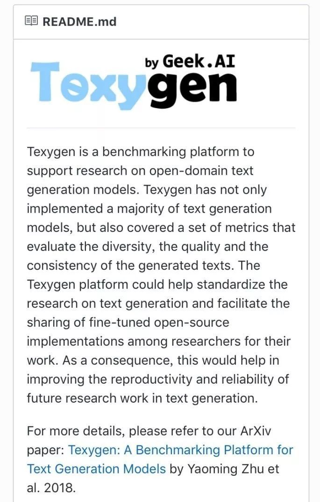</a> <h3><a href="https://github.com/geek-ai/Texygen">Texygen</a></h3>
⭐ 840 · <a href="https://github.com/geek-ai/Texygen">:octocat: Code</a>

文本生成

by <a href="https://github.com/geek-ai">@geek-ai</a>
</td><td valign="top" width="33.3%">  <h3><a href="https://github.com/asyml/texar-pytorch">texar-pytorch</a></h3>
⭐ 720 · <a href="https://github.com/asyml/texar-pytorch">:octocat: Code</a>

texar的pytorch实现

by <a href="https://github.com/asyml">@asyml</a>
</td><td valign="top" width="33.3%"> <a href="https://github.com/GaoPeng97/transformer-xl-chinese">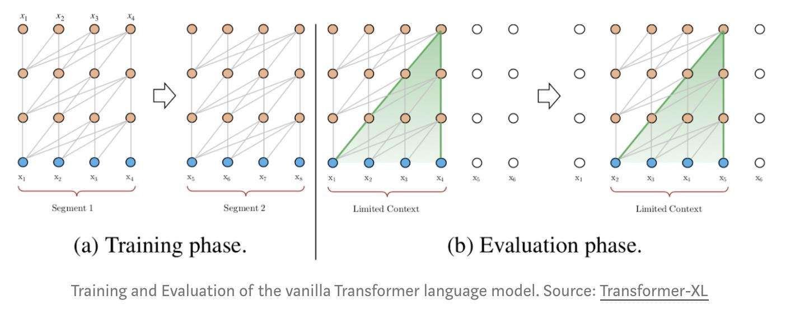</a> <h3><a href="https://github.com/GaoPeng97/transformer-xl-chinese">transformer-xl-chinese</a></h3>
⭐ 610 · <a href="https://github.com/GaoPeng97/transformer-xl-chinese">:octocat: Code</a>

transformer-xl中文文本生成

by <a href="https://github.com/GaoPeng97">@GaoPeng97</a>
</td></tr><tr align="center"><td valign="top" width="33.3%">  <h3><a href="https://github.com/ChenChengKuan/awesome-text-generation">awesome-text-generation</a></h3>
⭐ 460 · <a href="https://github.com/ChenChengKuan/awesome-text-generation">:octocat: Code</a>

awesome文本生成资料

by <a href="https://github.com/ChenChengKuan">@ChenChengKuan</a>
</td><td valign="top" width="33.3%">  <h3><a href="https://github.com/wangjiezju1988/aichpoem">aichpoem</a></h3>
⭐ 160 · <a href="https://github.com/wangjiezju1988/aichpoem">:octocat: Code</a>

诗歌生成

by <a href="https://github.com/wangjiezju1988">@wangjiezju1988</a>
</td><td valign="top" width="33.3%">  <h3><a href="https://github.com/WiseDoge/CoupletAI">CoupletAI</a></h3>
⭐ 140 · <a href="https://github.com/liuslnlp/CoupletAI">:octocat: Code</a>

AI对联生成

by <a href="https://github.com/WiseDoge">@WiseDoge</a>
</td></tr><tr align="center"><td valign="top" width="33.3%">  <h3><a href="https://github.com/kylemcdonald/gpt-2-poetry">gpt-2-poetry</a></h3>
⭐ 84 · <a href="https://github.com/kylemcdonald/gpt-2-poetry">:octocat: Code</a>

gpt2诗歌生成

by <a href="https://github.com/kylemcdonald">@kylemcdonald</a>
</td><td valign="top" width="33.3%"> <a href="https://github.com/YunwenTechnology/QueryGeneration">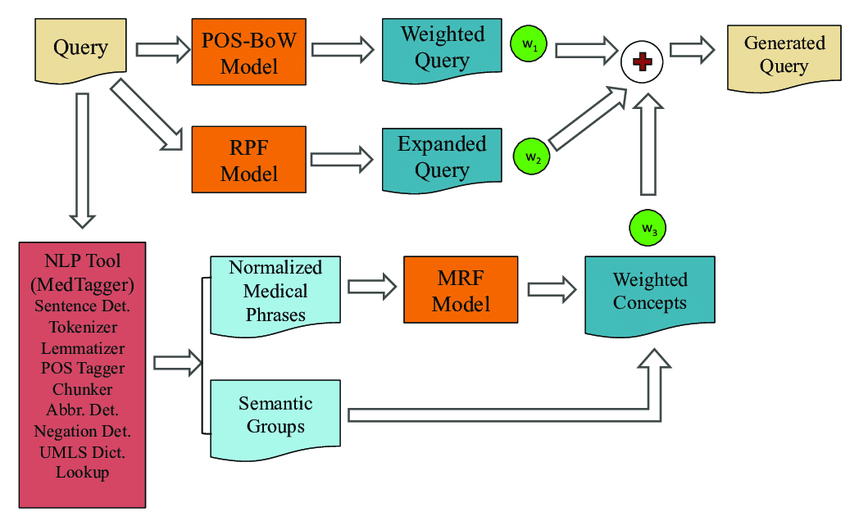</a> <h3><a href="https://github.com/YunwenTechnology/QueryGeneration">QueryGeneration</a></h3>
⭐ 83 · <a href="https://github.com/YunwenTechnology/QueryGeneration">:octocat: Code</a>

基于深度学习的相似问题生成

by <a href="https://github.com/YunwenTechnology">@YunwenTechnology</a>
</td></tr></table>

 

## 文本摘要生成

<table width="100%"><tr align="center"><td valign="top" width="33.3%">  <h3><a href="https://github.com/icoxfog417/awesome-text-summarization">awesome-text-summarization</a></h3>
⭐ 1.2K · <a href="https://github.com/icoxfog417/awesome-text-summarization">:octocat: Code</a>

awesome文本摘要生成资料

by <a href="https://github.com/icoxfog417">@icoxfog417</a>
</td><td valign="top" width="33.3%"> <a href="https://github.com/dmmiller612/bert-extractive-summarizer">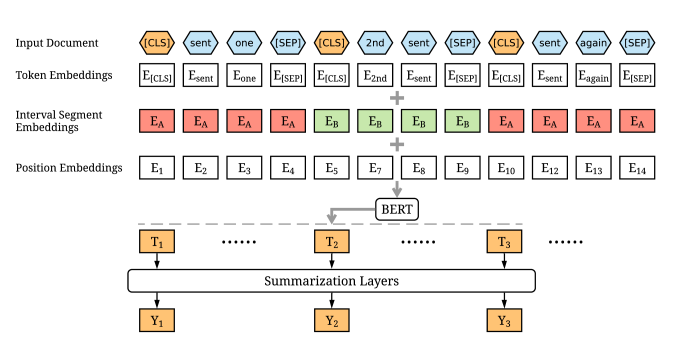</a> <h3><a href="https://github.com/dmmiller612/bert-extractive-summarizer">bert-extractive-summarizer</a></h3>
⭐ 1K · <a href="https://github.com/dmmiller612/bert-extractive-summarizer">:octocat: Code</a>

基于bert的抽取式文本摘要生成

by <a href="https://github.com/dmmiller612">@dmmiller612</a>
</td><td valign="top" width="33.3%">  <h3><a href="https://github.com/liucongg/GPT2-NewsTitle">GPT2-NewsTitle</a></h3>
⭐ 690 · <a href="https://github.com/liucongg/GPT2-NewsTitle">:octocat: Code</a>

GPT2新闻标题自动生成

by <a href="https://github.com/liucongg">@liucongg</a>
</td></tr><tr align="center"><td valign="top" width="33.3%"> <a href="https://github.com/neulab/Text-Summarization-Papers">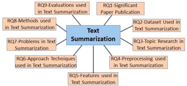</a> <h3><a href="https://github.com/neulab/Text-Summarization-Papers">Text-Summarization-Papers</a></h3>
⭐ 460 · <a href="https://github.com/neulab/Text-Summarization-Papers">:octocat: Code</a>

文本总结与摘要生成相关论文

by <a href="https://github.com/neulab">@neulab</a>
</td><td valign="top" width="33.3%"> <a href="https://github.com/ymfa/seq2seq-summarizer">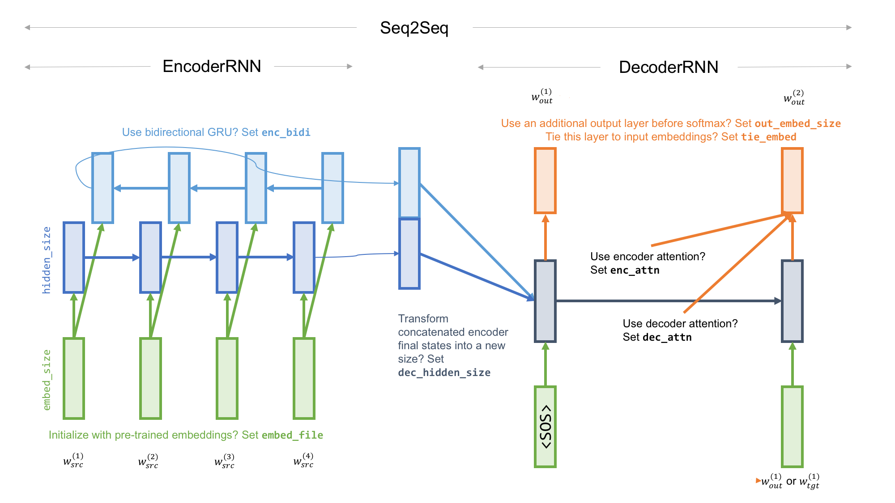</a> <h3><a href="https://github.com/ymfa/seq2seq-summarizer">seq2seq-summarizer</a></h3>
⭐ 350 · <a href="https://github.com/ymfa/seq2seq-summarizer">:octocat: Code</a>

seq2seq文本摘要生成

by <a href="https://github.com/ymfa">@ymfa</a>
</td><td valign="top" width="33.3%"> <a href="https://github.com/qingkongzhiqian/GPT2-Summary">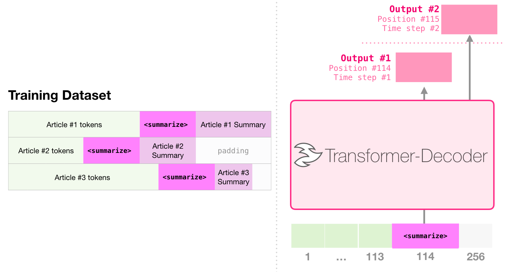</a> <h3><a href="https://github.com/qingkongzhiqian/GPT2-Summary">GPT2-Summary</a></h3>
⭐ 290 · <a href="https://github.com/qingkongzhiqian/GPT2-Summary">:octocat: Code</a>

GPT2文本摘要生成

by <a href="https://github.com/qingkongzhiqian">@qingkongzhiqian</a>
</td></tr><tr align="center"><td valign="top" width="33.3%">  <h3><a href="https://github.com/renatoviolin/Bart_T5-summarization">Bart_T5-summarization</a></h3>
⭐ 150 · <a href="https://github.com/renatoviolin/Bart_T5-summarization">:octocat: Code</a>

基于Bart-T5的文本摘要生成

by <a href="https://github.com/renatoviolin">@renatoviolin</a>
</td><td valign="top" width="33.3%"> <a href="https://github.com/lipiji/TranSummar">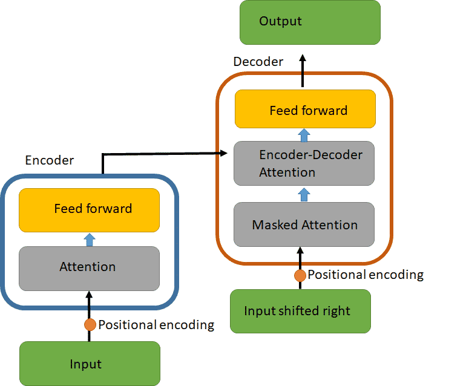</a> <h3><a href="https://github.com/lipiji/TranSummar">TranSummar</a></h3>
⭐ 130 · <a href="https://github.com/lipiji/TranSummar">:octocat: Code</a>

基于transformer的抽取式文本摘要生成

by <a href="https://github.com/lipiji">@lipiji</a>
</td><td valign="top" width="33.3%"> <a href="https://github.com/kedz/nnsum">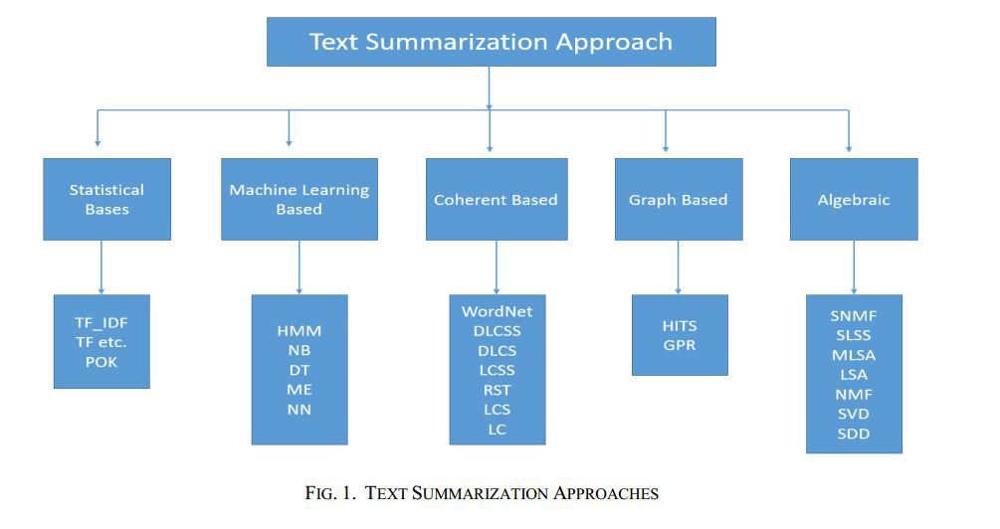</a> <h3><a href="https://github.com/kedz/nnsum">nnsum</a></h3>
⭐ 100 · <a href="https://github.com/kedz/nnsum">:octocat: Code</a>

基于深度学习的文本总结

by <a href="https://github.com/kedz">@kedz</a>
</td></tr><tr align="center"><td valign="top" width="33.3%"> <a href="https://github.com/tshi04/LeafNATS">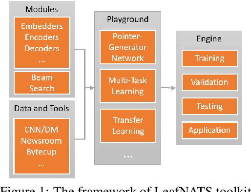</a> <h3><a href="https://github.com/tshi04/LeafNATS">Neural-Abstractive-Text-Summarization</a></h3>
⭐ 100 · <a href="https://github.com/tshi04/LeafNATS">:octocat: Code</a>

LeafNATS文本摘要生成框架

by <a href="https://github.com/tshi04">@tshi04</a>
</td></tr></table>

 

## 阅读理解

<table width="100%"><tr align="center"><td valign="top" width="33.3%"> <a href="https://github.com/namisan/mt-dnn">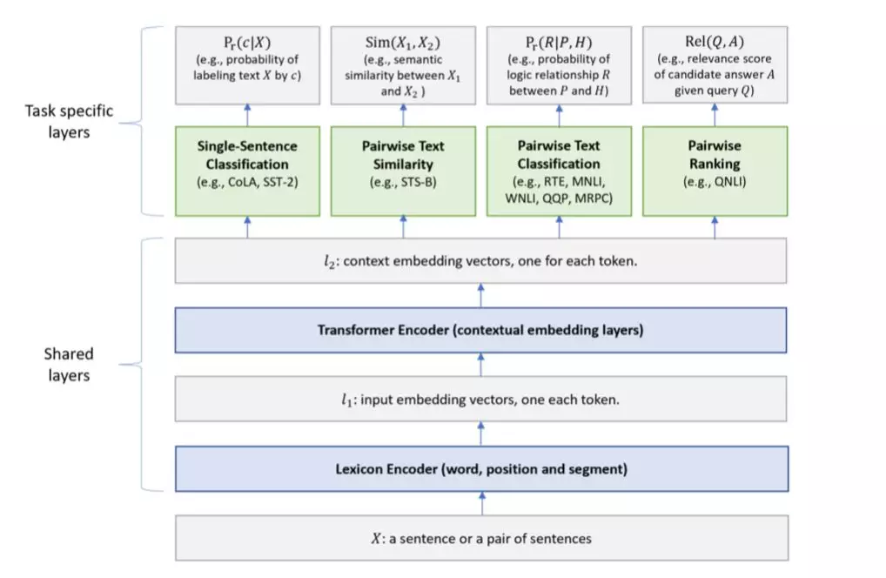</a> <h3><a href="https://github.com/namisan/mt-dnn">mt-dnn</a></h3>
⭐ 2K · <a href="https://github.com/namisan/mt-dnn">:octocat: Code</a>

基于多任务深度学习网络的文本理解

by <a href="https://github.com/namisan">@namisan</a>
</td><td valign="top" width="33.3%"> <a href="https://github.com/zhuchen03/FreeLB">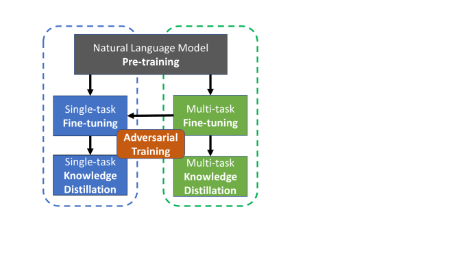</a> <h3><a href="https://github.com/zhuchen03/FreeLB">Adversarial-Training-for-Natural-Language-Understanding</a></h3>
⭐ 230 · <a href="https://github.com/zhuchen03/FreeLB">:octocat: Code</a>

基于对抗训练(Adversarial Training)的文本理解实现

by <a href="https://github.com/zhuchen03">@zhuchen03</a>
</td><td valign="top" width="33.3%"> <a href="https://github.com/microsoft/MT-DNN">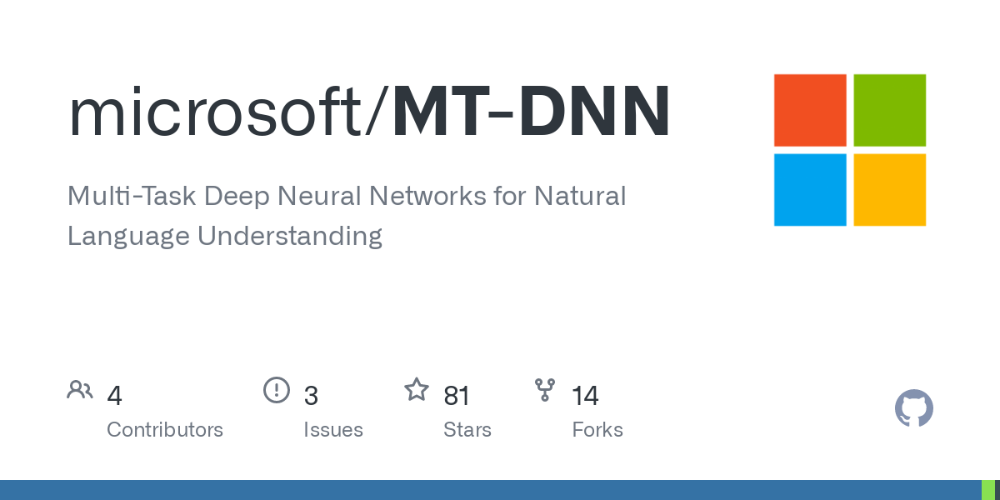</a> <h3><a href="https://github.com/microsoft/MT-DNN">microsoft-Natural-Language-Understanding</a></h3>
⭐ 120 · <a href="https://github.com/microsoft/MT-DNN">:octocat: Code</a>

基于多任务深度学习网络的文本理解(微软)

by <a href="https://github.com/microsoft">@microsoft</a>
</td></tr><tr align="center"><td valign="top" width="33.3%">  <h3><a href="https://github.com/freefuiiismyname/capsule-mrc">capsule-mrc</a></h3>
⭐ 88 · <a href="https://github.com/freefuiiismyname/capsule-mrc">:octocat: Code</a>

基于capsule的观点型阅读理解模型

by <a href="https://github.com/freefuiiismyname">@freefuiiismyname</a>
</td></tr></table>

 

## 时间序列

<table width="100%"><tr align="center"><td valign="top" width="33.3%">  <h3><a href="https://github.com/alan-turing-institute/sktime">sktime</a></h3>
⭐ 5.6K · <a href="https://github.com/alan-turing-institute/sktime">:octocat: Code</a>

scikit机器学习时间序列预估

by <a href="https://github.com/alan-turing-institute">@alan-turing-institute</a>
</td><td valign="top" width="33.3%">  <h3><a href="https://github.com/ourownstory/neural_prophet">neural_prophet</a></h3>
⭐ 2.5K · <a href="https://github.com/ourownstory/neural_prophet">:octocat: Code</a>

基于神经网络的prophet时间序列预估

by <a href="https://github.com/ourownstory">@ourownstory</a>
</td><td valign="top" width="33.3%">  <h3><a href="https://github.com/jdb78/pytorch-forecasting">pytorch-forecasting</a></h3>
⭐ 2.2K · <a href="https://github.com/jdb78/pytorch-forecasting">:octocat: Code</a>

pytorch时序预估

by <a href="https://github.com/jdb78">@jdb78</a>
</td></tr><tr align="center"><td valign="top" width="33.3%"> <a href="https://github.com/zalandoresearch/pytorch-ts">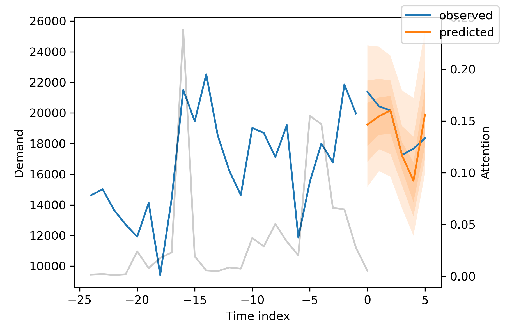</a> <h3><a href="https://github.com/zalandoresearch/pytorch-ts">pytorch-ts</a></h3>
⭐ 740 · <a href="https://github.com/zalandoresearch/pytorch-ts">:octocat: Code</a>

基于pytorch的时间序列预估

by <a href="https://github.com/zalandoresearch">@zalandoresearch</a>
</td><td valign="top" width="33.3%"> <a href="https://github.com/oliverguhr/transformer-time-series-prediction">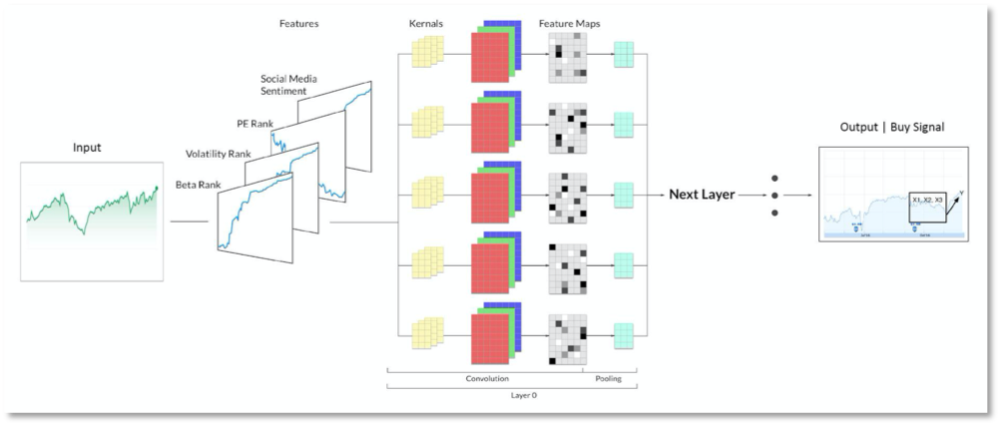</a> <h3><a href="https://github.com/oliverguhr/transformer-time-series-prediction">transformer-time-series-prediction</a></h3>
⭐ 610 · <a href="https://github.com/oliverguhr/transformer-time-series-prediction">:octocat: Code</a>

基于transformer的时间序列预估

by <a href="https://github.com/oliverguhr">@oliverguhr</a>
</td><td valign="top" width="33.3%"> <a href="https://github.com/Azure/DeepLearningForTimeSeriesForecasting">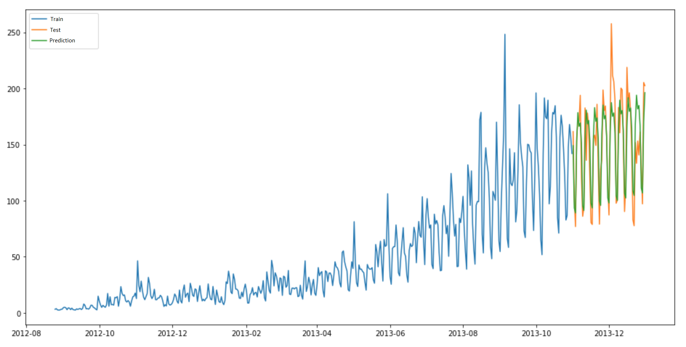</a> <h3><a href="https://github.com/Azure/DeepLearningForTimeSeriesForecasting">DeepLearning-For-Time-Series-Forecasting</a></h3>
⭐ 560 · <a href="https://github.com/Azure/DeepLearningForTimeSeriesForecasting">:octocat: Code</a>

微软深度学习时间序列预估实现

by <a href="https://github.com/Azure">@Azure</a>
</td></tr><tr align="center"><td valign="top" width="33.3%">  <h3><a href="https://github.com/sktime/sktime-dl">sktime-dl</a></h3>
⭐ 560 · <a href="https://github.com/sktime/sktime-dl">:octocat: Code</a>

scikit深度学习时间序列分类与回归

by <a href="https://github.com/sktime">@sktime</a>
</td><td valign="top" width="33.3%">  <h3><a href="https://github.com/cuge1995/awesome-time-series">awesome-time-series</a></h3>
⭐ 510 · <a href="https://github.com/cuge1995/awesome-time-series">:octocat: Code</a>

awesome时间序列预估资料

by <a href="https://github.com/cuge1995">@cuge1995</a>
</td><td valign="top" width="33.3%"> <a href="https://github.com/EvilPsyCHo/Deep-Time-Series-Prediction">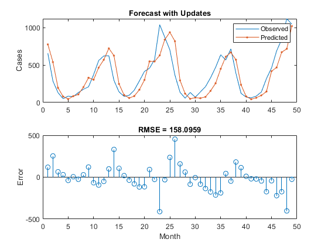</a> <h3><a href="https://github.com/EvilPsyCHo/Deep-Time-Series-Prediction">Deep-Time-Series-Prediction</a></h3>
⭐ 380 · <a href="https://github.com/EvilPsyCHo/Deep-Time-Series-Prediction">:octocat: Code</a>

深度学习时间序列预估

by <a href="https://github.com/EvilPsyCHo">@EvilPsyCHo</a>
</td></tr><tr align="center"><td valign="top" width="33.3%"> <a href="https://github.com/carlomazzaferro/scikit-hts">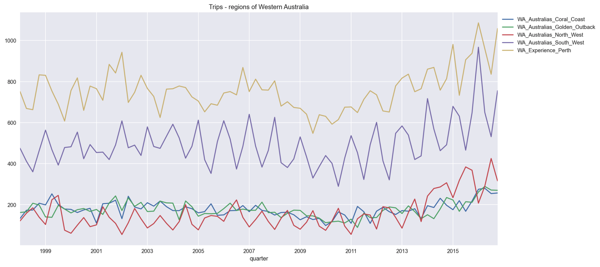</a> <h3><a href="https://github.com/carlomazzaferro/scikit-hts">scikit-hts</a></h3>
⭐ 200 · <a href="https://github.com/carlomazzaferro/scikit-hts">:octocat: Code</a>

scikit层次化时间序列预估库

by <a href="https://github.com/carlomazzaferro">@carlomazzaferro</a>
</td></tr></table>

 

## 机器翻译

<table width="100%"><tr align="center"><td valign="top" width="33.3%">  <h3><a href="https://github.com/tensorflow/nmt">tensorflow-nmt</a></h3>
⭐ 6.1K · <a href="https://github.com/tensorflow/nmt">:octocat: Code</a>

tensorflow神经网络机器翻译库

by <a href="https://github.com/tensorflow">@tensorflow</a>
</td><td valign="top" width="33.3%"> <a href="https://github.com/OpenNMT/OpenNMT-py">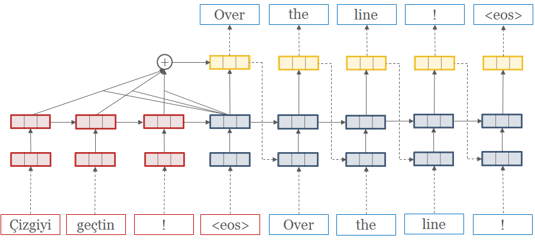</a> <h3><a href="https://github.com/OpenNMT/OpenNMT-py">OpenNMT-py</a></h3>
⭐ 5.7K · <a href="https://github.com/OpenNMT/OpenNMT-py">:octocat: Code</a>

OpenNMT神经网络机器翻译库

by <a href="https://github.com/OpenNMT">@OpenNMT</a>
</td><td valign="top" width="33.3%"> <a href="https://github.com/facebookresearch/UnsupervisedMT">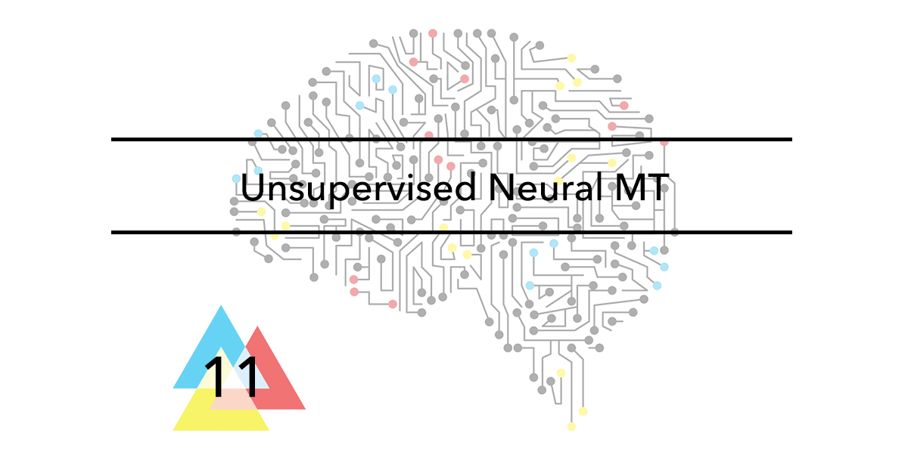</a> <h3><a href="https://github.com/facebookresearch/UnsupervisedMT">facebookresearch-UnsupervisedMT</a></h3>
⭐ 1.5K · <a href="https://github.com/facebookresearch/UnsupervisedMT">:octocat: Code</a>

FacebookResearch的无监督机器翻译库

by <a href="https://github.com/facebookresearch">@facebookresearch</a>
</td></tr><tr align="center"><td valign="top" width="33.3%">  <h3><a href="https://github.com/OpenNMT/OpenNMT-tf">OpenNMT-tf</a></h3>
⭐ 1.3K · <a href="https://github.com/OpenNMT/OpenNMT-tf">:octocat: Code</a>

OpenNMT神经网络机器翻译库(tensorflow版本)

by <a href="https://github.com/OpenNMT">@OpenNMT</a>
</td><td valign="top" width="33.3%"> <a href="https://github.com/EdinburghNLP/nematus">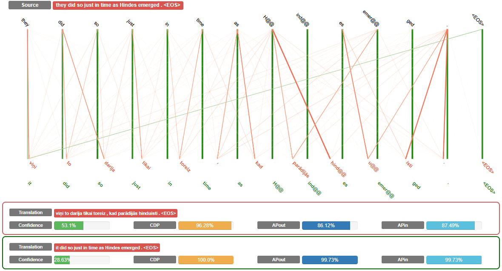</a> <h3><a href="https://github.com/EdinburghNLP/nematus">nematus</a></h3>
⭐ 780 · <a href="https://github.com/EdinburghNLP/nematus">:octocat: Code</a>

nematus神经网络机器翻译库

by <a href="https://github.com/EdinburghNLP">@EdinburghNLP</a>
</td><td valign="top" width="33.3%"> <a href="https://github.com/UlionTse/translators">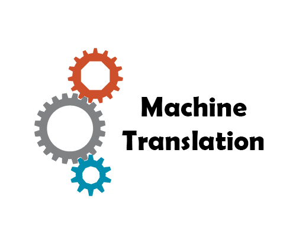</a> <h3><a href="https://github.com/UlionTse/translators">translators</a></h3>
⭐ 760 · <a href="https://github.com/UlionTse/translators">:octocat: Code</a>

机器翻译库

by <a href="https://github.com/UlionTse">@UlionTse</a>
</td></tr><tr align="center"><td valign="top" width="33.3%">  <h3><a href="https://github.com/UKPLab/EasyNMT">EasyNMT</a></h3>
⭐ 610 · <a href="https://github.com/UKPLab/EasyNMT">:octocat: Code</a>

EasyNMT神经网络机器翻译库

by <a href="https://github.com/UKPLab">@UKPLab</a>
</td><td valign="top" width="33.3%"> <a href="https://github.com/joeynmt/joeynmt">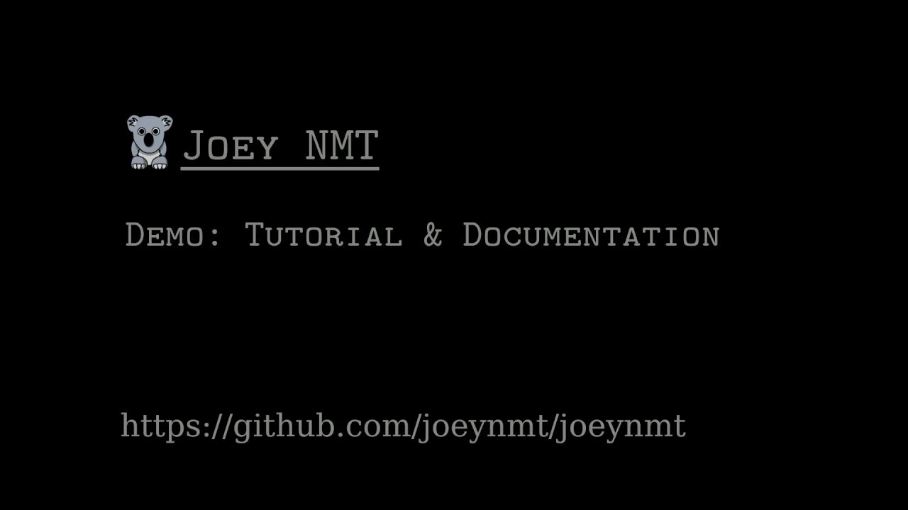</a> <h3><a href="https://github.com/joeynmt/joeynmt">joeynmt</a></h3>
⭐ 560 · <a href="https://github.com/joeynmt/joeynmt">:octocat: Code</a>

神经网络机器翻译

by <a href="https://github.com/joeynmt">@joeynmt</a>
</td></tr></table>

 

## 文本检索与语义匹配

<table width="100%"><tr align="center"><td valign="top" width="33.3%">  <h3><a href="https://github.com/NTMC-Community/MatchZoo">MatchZoo</a></h3>
⭐ 3.7K · <a href="https://github.com/NTMC-Community/MatchZoo">:octocat: Code</a>

包含多种文本匹配模型的MatchZoo库

by <a href="https://github.com/NTMC-Community">@NTMC-Community</a>
</td><td valign="top" width="33.3%"> <a href="https://github.com/NTMC-Community/awesome-neural-models-for-semantic-match">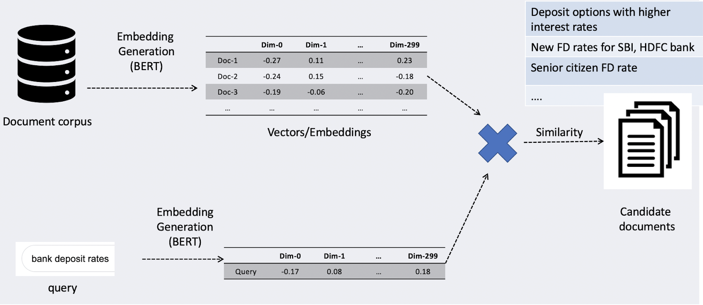</a> <h3><a href="https://github.com/NTMC-Community/awesome-neural-models-for-semantic-match">awesome-neural-models-for-semantic-match</a></h3>
⭐ 750 · <a href="https://github.com/NTMC-Community/awesome-neural-models-for-semantic-match">:octocat: Code</a>

awesome神经网络语义匹配资料

by <a href="https://github.com/NTMC-Community">@NTMC-Community</a>
</td><td valign="top" width="33.3%"> <a href="https://github.com/terrifyzhao/text_matching">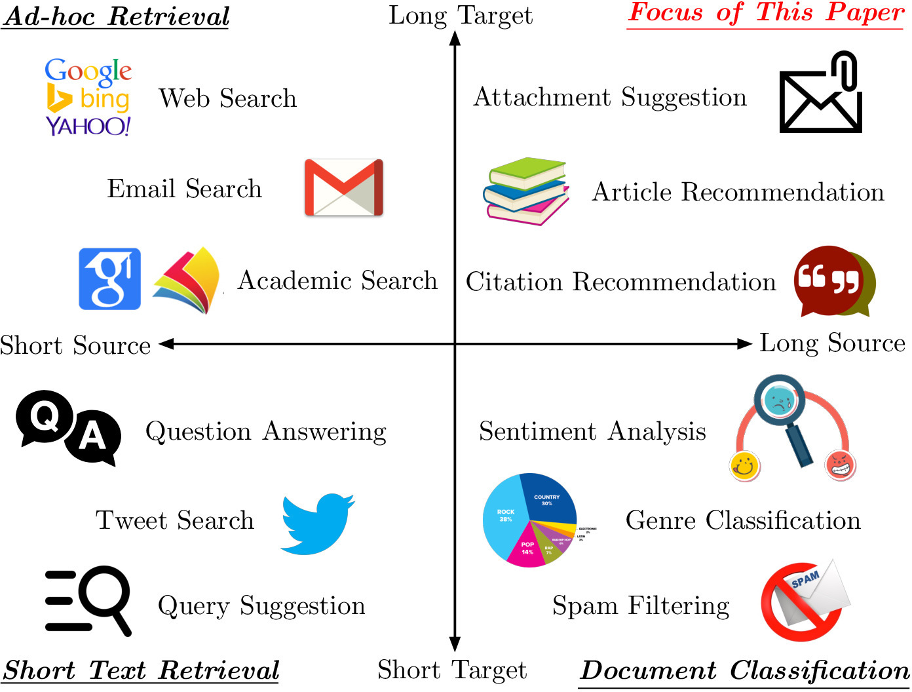</a> <h3><a href="https://github.com/terrifyzhao/text_matching">text_matching</a></h3>
⭐ 620 · <a href="https://github.com/terrifyzhao/text_matching">:octocat: Code</a>

文本匹配模型实现

by <a href="https://github.com/terrifyzhao">@terrifyzhao</a>
</td></tr><tr align="center"><td valign="top" width="33.3%">  <h3><a href="https://github.com/zhaogaofeng611/TextMatch">TextMatch</a></h3>
⭐ 580 · <a href="https://github.com/zhaogaofeng611/TextMatch">:octocat: Code</a>

TextMatch文本匹配实现

by <a href="https://github.com/zhaogaofeng611">@zhaogaofeng611</a>
</td><td valign="top" width="33.3%">  <h3><a href="https://github.com/eBay/Sequence-Semantic-Embedding">eBay-Sequence-Semantic-Embedding</a></h3>
⭐ 450 · <a href="https://github.com/eBay/Sequence-Semantic-Embedding">:octocat: Code</a>

eBay的序列语义embedding工具库

by <a href="https://github.com/eBay">@eBay</a>
</td><td valign="top" width="33.3%"> <a href="https://github.com/anhaidgroup/deepmatcher">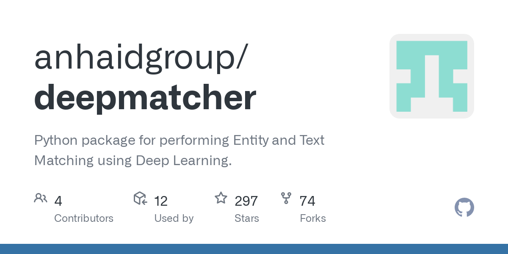</a> <h3><a href="https://github.com/anhaidgroup/deepmatcher">deepmatcher</a></h3>
⭐ 440 · <a href="https://github.com/anhaidgroup/deepmatcher">:octocat: Code</a>

深度学习文本匹配库

by <a href="https://github.com/anhaidgroup">@anhaidgroup</a>
</td></tr><tr align="center"><td valign="top" width="33.3%"> <a href="https://github.com/alibaba-edu/simple-effective-text-matching">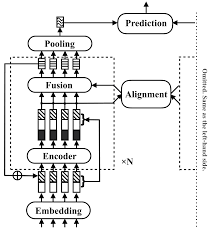</a> <h3><a href="https://github.com/alibaba-edu/simple-effective-text-matching">alibaba-simple-effective-text-matching</a></h3>
⭐ 330 · <a href="https://github.com/alibaba-edu/simple-effective-text-matching">:octocat: Code</a>

ACL2019论文“简单高效文本匹配”实现

by <a href="https://github.com/alibaba-edu">@alibaba-edu</a>
</td><td valign="top" width="33.3%"> <a href="https://github.com/alibaba-edu/simple-effective-text-matching-pytorch">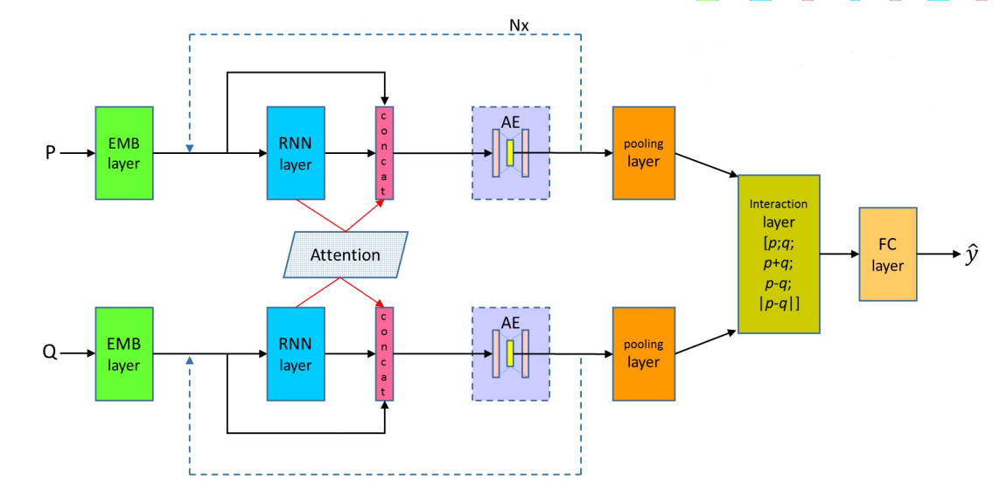</a> <h3><a href="https://github.com/alibaba-edu/simple-effective-text-matching-pytorch">alibaba-simple-effective-text-matching-pytorch</a></h3>
⭐ 270 · <a href="https://github.com/alibaba-edu/simple-effective-text-matching-pytorch">:octocat: Code</a>

ACL2019论文“简单高效文本匹配”实现(pytorch版本)

by <a href="https://github.com/alibaba-edu">@alibaba-edu</a>
</td><td valign="top" width="33.3%">  <h3><a href="https://github.com/renatoviolin/Semantic-Search">Semantic-Search</a></h3>
⭐ 100 · <a href="https://github.com/renatoviolin/Semantic-Search">:octocat: Code</a>

语义检索系统

by <a href="https://github.com/renatoviolin">@renatoviolin</a>
</td></tr></table>

---

## 相关资源

- [**Python资源汇集列表**](https://github.com/HanXinzi-AI/awesome-python-resources): 周更新的各种应用方向与主题的资源汇集列表
- [**python机器学习资源大全**](https://github.com/HanXinzi-AI/awesome-python-machine-learning-resources): 周更新的各种python机器学习资源汇集列表
- [**Jupyter及相关工具资源大全**](https://github.com/HanXinzi-AI/awesome-jupyter-resources): 周更新的各种Jupyter及相关工具资源汇集列表
- [**NLP项目和资源大全**](https://github.com/HanXinzi-AI/awesome-NLP-resources): 周更新的各种NLP板块涉及的项目和工具资源汇集列表
- [**CV项目和资源大全**](https://github.com/HanXinzi-AI/awesome-computer-vision-resources): 周更新的各种CV板块涉及的项目和工具资源汇集列表
